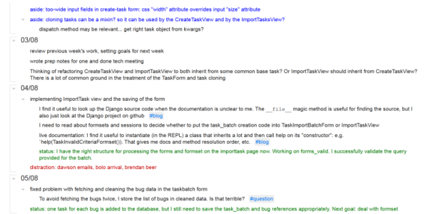

Title: Snapshots from my OPW Internship with Mozilla QA
Date: 2014-08-07
Modified: 2014-08-23
Tags: opw, mozilla, foss
Slug: opw-snapshot
Author: Maja Z. Frydrychowicz
Summary: A description of a "typical" two weeks during my OPW internship with Mozilla.

[checkvist]:https://checkvist.com/
[wrangler]: https://wiki.mozilla.org/GNOME_Outreach_Summer2014#Mozilla_Bug_Wrangler_.28Desktop_QA.29
[oneanddone]: https://github.com/mozilla/oneanddone

[^1]:Outreach Program for Women
[^2]:Quality Assurance
[^3]: I write the log using [Checkvist][checkvist]. It's fantastic. I did the same while at Hacker School.

Throughout my OPW[^1] internship with Mozilla QA[^2] I've been keeping an informal log in outline form[^3]. In it, I briefly describe what I accomplish (or fail to accomplish) each day, problems I encounter, who I talk to about them, which meetings I attend, what I read, useful tricks I learn, etc. So far, I have about 60-days worth of these tiny log entries about Mozilla.  Here's what they look like:

Day-to-day, the log helps me answer questions like "How did I solve this weird configuration problem three weeks ago?" or "What should I ask about at the next team meeting?" Writing also generally helps me think through a task, and the log is a quick and effective outlet for that. The other major benefit is that I can take a step back and see the overall progress of my projects.

# So, what's it like being an intern with Mozilla QA?

I'm so glad you asked! First, some context. 

* OPW interns [work remotely]({filename}./2014-05-23_remote-work.md).
* The internship position I applied for is called "[Bug Wrangler][wrangler]", which refers to tasks like reproducing and triaging incoming Firefox bugs, but I've actually (mostly) been doing Django web development.

*__To future interns__: as in my case, there can be some flexibility about your internship activities, and during your application process, you'll narrow down what you will work on. The mentor I applied to offered a Django project as an option under the Bug Wrangler umbrella, and that was more in line with my interests and experience than bug triage, so that's what I chose to focus on.*

Based on my handy log, I'll answer a slightly more specific question:
>> "What did Maja do during a typical week while working on a Django project for Mozilla QA?"

## Routines
Often, I start my day by skimming my latest "bug mail" (updates from Bugzilla) and checking my Bugzilla dashboard to see if I need to follow up on anything immediately. 

The other regular occurrence is about 2 hours of video meetings per week. I meet with my mentor once a week to discuss my general progress and my post-internship plans. I lurk at one QA team meeting almost every week, where I mostly don't have enough context to understand much. My mentor filled me in on some things and my understanding gradually improved. There are also two regular meetings for [One and Done][oneanddone], the project I'm contributing to: a weekly technical meeting to discuss the design of new features, and a biweekly check-in meeting with project managers, developers and a few key users.

## Week 3

The early weeks of the internship involved a lot of reading and trying things out, of course. At this point, I was finishing up the official Django tutorial as well as responding to some administrative requests about the internship. 

Just for fun, I used vim throughout my Django learnings to rediscover some handy vim commands. I also applied the tutorial concepts to the One and Done source code as much as I could, and thus discovered what other parts of Django I need to become familiar with, like generic class-based views. 

I gradually became more familiar with how the One and Done code is structured by looking at how its models are used, poking at its URLconf, and populating my local database with example data.

## Week 5

At this point, I was just about finished with my first substantial [pull request to One and Done](https://github.com/mozilla/oneanddone/pull/124). My changes broke some unit tests, which caused me to discover that some of our test data was using the wrong data type: a regular Python dictionary instead of a Django [QueryDict](https://docs.djangoproject.com/en/1.4/ref/request-response/#django.http.QueryDict). Cool.

I actually spent a bunch of time getting the unit tests to run in my dev environment, which is on a Linux virtual machine. My local copy of the project is stored in a directory that is shared between my Linux guest OS and Windows host OS, which happens to rely on file permissions that the [nose](https://nose.readthedocs.org/en/latest/) testing library doesn't like. In the end, I chose to have a clone of the project in a non-shared directory that I used just for running unit tests.

My work log also describes in detail how unintended changes to my development branch in git turned my Github pull request into a giant, unreadable mess. Aaah! (Be careful what you branch from and what you merge with, friends.) I had to close my original pull request and make a new, clean one, which was fairly embarrassing. Now I remember that on that day my friend and I were co-working in my apartment to battle [the loneliness of remote work]({filename}./2014-05-23_remote-work.md), and she generously listened to me venting my misery about the incident. :) In retrospect, I learned a lot about git.

Later that week, that same pull request got merged and I started investigating a bug I ran into in one of the libraries our project relies on, which involved asking some questions on IRC. 

All around, a good week.

## Week 9

First I finished up a couple of things I had started earlier:

* updating the [One and Done readme](https://github.com/mozilla/oneanddone/pull/139) to make it easier for new contributors to get started, 
* adding tests to a [pull request about form validation](https://github.com/mozilla/oneanddone/pull/151) I had made the week before,
* cleaning up an article about my [database migration blunders]({filename}./2014-07-04_borked-migrations.md).

I also contributed my first few code reviews: the week before I missed an issue that someone else caught (doh!), but this week I found something that needed to be fixed (yay!). This was cool because I found the problem by simply taking the time to understand code that was [mostly mysterious to me](https://github.com/mozilla/oneanddone/pull/154#discussion_r14786905). Bonus: I learned a bit about [Mock and patch](http://www.voidspace.org.uk/python/mock/).

By the end of the week, I was focused on sketching out the functionality and implementation of a [new One and Done feature](https://bugzilla.mozilla.org/show_bug.cgi?id=1030972). I enjoyed working with the project managers to define the feature requirements. Figuring out how to implement them required a few more weeks of research and learning on my part, but it all worked out in the end.

# This is why I like work logs!

Reviewing my work log to write this article was eye-opening for me, especially due to the perspective it offers of the ups and downs I experienced during my internship. On some days, I felt quite frustrated, stuck, discouraged, and all that bad stuff. So, I like how the log shows that feeling crappy for a few days here and there totally doesn't matter overall. I learned a lot in the past couple of months and it's incredibly satisfying to see that itemized in one big list.
